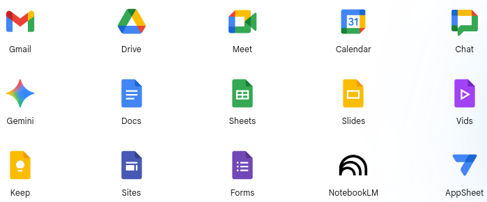

# Google Suite
## Google Workspace - Architecture, Security Considerations & Risk Mitigation

### Introduction & Overview
Google Workspace is a suite of cloud-based productivity and collaboration applications developed by Google LLC. It comprises services including Gmail (email), Google Drive (file storage and sharing), Google Docs/Sheets/Slides (document creation and editing), Google Meet (video conferencing), Google Calendar, and others. From a cybersecurity perspective, Google Workspace presents a complex landscape of both inherent security advantages and potential vulnerabilities that require careful management by organizations adopting this platform. Its reliance on cloud infrastructure necessitates a shift in traditional security paradigms.

### Architectural Components & Data Flow

- **Distributed Infrastructure:**Google Workspace leverages Google’s global network of data centers, providing high availability and scalability. Data is geographically distributed based on user location and service requirements.

- **Service-Specific Architectures:** Each application within Google Workspace has its own underlying architecture:
  - **Gmail:** Relies heavily on web servers, databases (likely a combination of relational and NoSQL), and email routing infrastructure.
  - **Google Drive:** Utilizes distributed object storage systems for file storage and content delivery networks (CDNs) for efficient access.
  - **Google Docs/Sheets/Slides:** Employs real-time collaborative editing engines built on web technologies, often leveraging WebSockets or similar protocols for low-latency updates.
 
- **APIs & Integrations:** Google Workspace provides a robust set of APIs (Application Programming Interfaces) allowing integration with third-party applications and custom development. These APIs are critical for automation but also represent potential attack surfaces. Examples include:
  - **Google Apps Script:** A cloud-based scripting language enabling users to automate tasks and extend Google Workspace functionality.
  - **OAuth 2.0:** Used for delegated access, allowing third-party applications to access user data with permission.

- **Identity Management:** Google Workspace integrates with Google Identity Platform (formerly known as Google Accounts) providing centralized identity management and authentication services.

### Security Considerations & Potential Attack Vectors
---

### Next Step
- [Basics Of Computer Networking](https://github.com/Sisu-Sus/CyberSec-RoadMap/blob/main/Fundamental_IT_Skills/Basics_Of_Computer_Networking.md)
- [Index](https://github.com/Sisu-Sus/CyberSec-RoadMap/blob/main/index.md)
