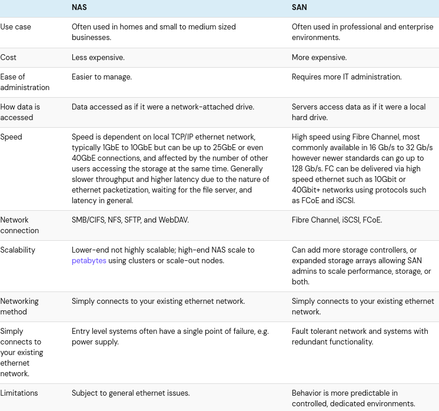

# Basics Of NAS And SAN

## NAS vs SAN: Understanding The Differences
Organizations face the challenge of managing ever-increasing data volumes and ensuring reliable access for critical applications. Two key technologies addressing this are Network Attached Storage (NAS) and Storage Area Networks (SANs). While both provide centralized storage, their architectures and use cases differ significantly.

A **Network Attached Storage (NAS)** device presents itself as a file server on the network. It operates at the file level, meaning clients access data through standard protocols like NFS or SMB/CIFS. This simplifies deployment and management, making NAS suitable for environments prioritizing ease of use and cost-effectiveness - common in small to medium businesses. Its primary function is facilitating file sharing, centralized backups, and providing accessible storage resources across a network.

In contrast, a **Storage Area Network (SAN)** provides block-level access to storage. Server perceive the SAN as directly attached storage, bypassing traditional file system layers. This architecture leverages high-performance protocols like Fibre Channel or iSCSI, enabling significantly lower latency and higher throughput compared to NAS. SANs are typically deployed in enterprise environments supporting demanding workloads such as databases, virtualization platforms, and applications requiring consistent, high-speed data access. The key distinction is that a SAN prioritizes performance and scalability dor server-centric operations, while a NAS focuses on file accessibility across the network.

### Resource
[https://www.backblaze.com/blog/whats-the-diff-nas-vs-san/](https://www.backblaze.com/blog/whats-the-diff-nas-vs-san/)

### Next step
- [Basics Of Subnets](https://github.com/Sisu-Sus/CyberSec-RoadMap/blob/main/Networking_Knowledge/IP_Terms/Basics_Of_Subnets.md)
- [Index](https://github.com/Sisu-Sus/CyberSec-RoadMap/blob/main/index.md)
