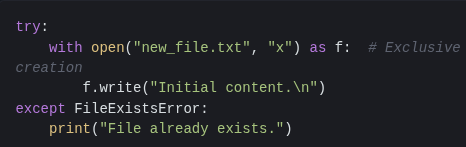
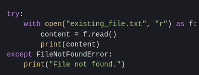
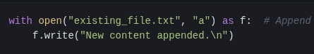

# File System Operations: CREATE, READ, UPDATE, DELETE (CRUD)
## Introduction: The CRUD Cycle and File Management
The CREATE, READ, UPDATE, DELETE (CRUD) operations form the foundation of data management in virtually every software application. When applied to files, these operations define how programs interact with persistent storage. Understanding these operations is critical for both development and security auditing. This document will explore each operation within the context of file systems, highlighting potential vulnerabilities.

## CREATE: File Creation & Initialization
**Definition:** The `CREATE` operation establishes a new file on the file system.

**Technical Details:** This typically involves allocating disk space (or equivalent storage) and creating metadata entries that describe the file (name, size, permissions, timestamps). In programming languages like Python, this is often achieved using modes like "w" (write - overwrites existing files if they exist) or "x" (exclusive creation – fails if the file already exists).

**Example (Python)**:
  
 

**Potential Issues:**
  - **Race Conditions:** Multiple processes attempting to create a file with the same name simultaneously can lead to unpredictable behavior and data corruption. Proper locking mechanisms are essential in concurrent environments
  - **Insufficient Permissions:** The process must have write permissions within the target directory.

## READ: File Content Retrieval
**Definition:** The `READ` operation retrieves data from an existing file.

**Technical Details:** This involves accessing the allocated disk blocks associated with the file and transferring their contents into memory. File systems often support various read modes (sequential, random access).

**Example (Python):**

**Potential Issues:**
**Buffer Overflows:** If the read buffer is too small to accommodate the file's contents, a buffer overflow can occur, potentially overwriting adjacent memory regions. This is less common with modern languages that handle memory management automatically but remains a concern in lower-level programming.

**Denial of Service (DoS):** An attacker could create extremely large files to exhaust available disk space or memory during read operations, rendering the system unresponsive.

## UPDATE: File Content Modification
**Definition:** The `UPDATE` operation modifies existing data within a file.

**Technical Details:** Updates can involve appending new data (adding to the end of the file) or overwriting existing content. Overwriting requires careful management of disk blocks and metadata updates. Some file systems support direct block addressing, while others use indirect methods.

**Example (Python - Appending)

### Next Steps
- [Troubleshooting](https://github.com/Sisu-Sus/CyberSec-RoadMap/blob/main/Operating_Systems/Troubleshooting.md)
- [Index](https://github.com/Sisu-Sus/CyberSec-RoadMap/blob/main/index.md)

### Resource
- [https://www.crowdstrike.com/en-us/cybersecurity-101/observability/crud/](https://www.crowdstrike.com/en-us/cybersecurity-101/observability/crud/)
- [Python Documentation](https://docs.python.org/3/library/os.html)
