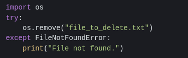

# File System Operations: CREATE, READ, UPDATE, DELETE (CRUD)
## Introduction: The CRUD Cycle and File Management
The CREATE, READ, UPDATE, DELETE (CRUD) operations form the foundation of data management in virtually every software application. When applied to files, these operations define how programs interact with persistent storage. Understanding these operations is critical for both development and security auditing. This document will explore each operation within the context of file systems, highlighting potential vulnerabilities.

## CREATE: File Creation & Initialization
**Definition:** The `CREATE` operation establishes a new file on the file system.

**Technical Details:** This typically involves allocating disk space (or equivalent storage) and creating metadata entries that describe the file (name, size, permissions, timestamps). In programming languages like Python, this is often achieved using modes like "w" (write - overwrites existing files if they exist) or "x" (exclusive creation – fails if the file already exists).

**Example (Python)**:
  
 

**Potential Issues:**
  - **Race Conditions:** Multiple processes attempting to create a file with the same name simultaneously can lead to unpredictable behavior and data corruption. Proper locking mechanisms are essential in concurrent environments
  - **Insufficient Permissions:** The process must have write permissions within the target directory.

## READ: File Content Retrieval
**Definition:** The `READ` operation retrieves data from an existing file.

**Technical Details:** This involves accessing the allocated disk blocks associated with the file and transferring their contents into memory. File systems often support various read modes (sequential, random access).

**Example (Python):**

**Potential Issues:**
**Buffer Overflows:** If the read buffer is too small to accommodate the file's contents, a buffer overflow can occur, potentially overwriting adjacent memory regions. This is less common with modern languages that handle memory management automatically but remains a concern in lower-level programming.

**Denial of Service (DoS):** An attacker could create extremely large files to exhaust available disk space or memory during read operations, rendering the system unresponsive.

## UPDATE: File Content Modification
**Definition:** The `UPDATE` operation modifies existing data within a file.

**Technical Details:** Updates can involve appending new data (adding to the end of the file) or overwriting existing content. Overwriting requires careful management of disk blocks and metadata updates. Some file systems support direct block addressing, while others use indirect methods.

**Example (Python - Appending)

**Potential Issues:**
- **Data Corruption:** Incorrect update operations can lead to data corruption, especially if file system metadata is not updated correctly.
- **Concurrency Conflicts:** Multiple processes attempting to update the same file simultaneously require robust locking mechanisms to prevent lost updates or inconsistent data.
- **File Size Limits:** Filesystems have maximum size limits. Attempting to write beyond these limits will result in errors.

## DELETE: File Removal
**Definition:** The `DELETE` operation removes a file from the file system

**Technical Details:** This involves deallocating the disk blocks associated with the file and removing its metadata entry. The space occupied by the file becomes available for reuse. Deletion is often logical; the data may remain on the disk until overwritten, making recovery possible.

**Example (Python):**

**Potential Issues:**
- **Insufficient Permissions:** The process must have write permissions on the directory containing the file to be able to delete it, not necessarily on the file itself.

- **Data Recovery:** Deleted files can sometimes be recovered using specialized tools if the disk space has not been overwritten. Secure deletion techniques (e.g., overwriting with random data) are necessary for sensitive information.

## Security Considerations & Attack Vectors
The CRUD operations, particularly CREATE and UPDATE, are frequent targets for attackers:

  - **File Upload Vulnerabilities:** A common attack vector involves malicious users uploading files to a server. If the server does not properly validate file types, sizes, and content, attackers can upload executable code (e.g., PHP scripts, shell scripts) that can be executed on the server, leading to remote code execution. The OWASP File Upload Cheat Sheet is essential reading for developers handling user-uploaded files.
  
  - **Path Traversal:** Attackers may attempt to manipulate file paths in CREATE, READ, and UPDATE operations to access files outside of the intended directory (e.g., accessing /etc/passwd). Input validation and sanitization are crucial to prevent this.

  - **Directory Listing:** Improperly configured web servers might allow attackers to browse directories, revealing file names and potentially sensitive information.

  - **SQL Injection (Indirect):** If filenames or file contents are used in database queries without proper escaping, SQL injection vulnerabilities can arise.

The CRUD operations on files are fundamental building blocks of software systems. A thorough understanding of these operations, along with their potential security implications, is essential for developing robust and secure applications. Careful attention to input validation, access control, concurrency management, and secure deletion practices is paramount in mitigating risks.

### Next Steps
- [Troubleshooting](https://github.com/Sisu-Sus/CyberSec-RoadMap/blob/main/Operating_Systems/Troubleshooting.md)
- [Index](https://github.com/Sisu-Sus/CyberSec-RoadMap/blob/main/index.md)

### Resource
- [https://www.crowdstrike.com/en-us/cybersecurity-101/observability/crud/](https://www.crowdstrike.com/en-us/cybersecurity-101/observability/crud/)
- [Python Documentation](https://docs.python.org/3/library/os.html)
