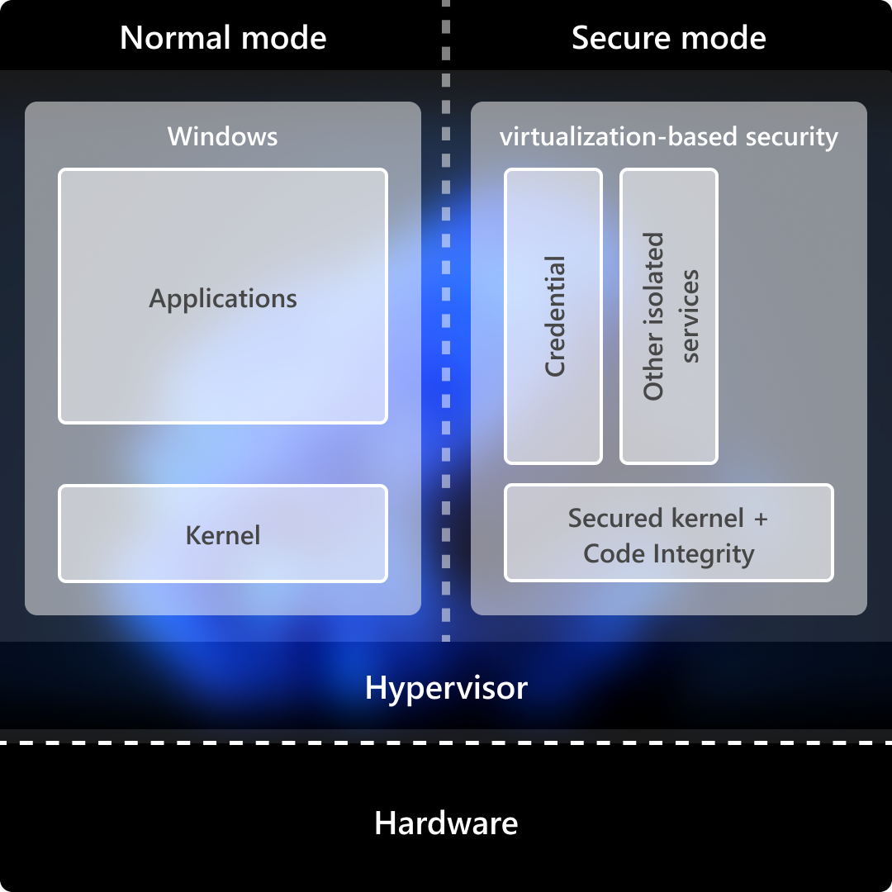

# Windows

## Roadmap.sh Summary:
Windows is Microsoft's widely-used operating system for personal computers and servers. It provides a graphical user interface, multitasking capabilities, and supports a vast array of software applications and hardware devices. Windows offers features like file management, user account control, built-in security tools, and regular updates. it comes in various editions for different use cases, from home computing to enterprise environments. Windows integrates with Microsoft's cloud services and includes tools for productivity, gaming, and system management. It's widespread adoption makes it a primary target for both software developers and cybersecurity threats, necessitating regular security updates and patches. 

## Resource
[https://learn.microsoft.com/en-us/windows/security/](https://learn.microsoft.com/en-us/windows/security/)

## Hardware Security
### Windows 11 Security
In parternership with our silicon and device manufacturing partners, Windows 11 devices shield software, hardware, and firmware with features like Trusted Platform Module (TPM) 2.0 , Microsofft Pluton, and Virtualization-based Security (VBS). Windows 11 devices provide hardware-backed protection by default to significantly improve security while maintaing the performance that users expect.

### Trusted Platform Module (TPM)
TPM technology is designed to provide hardware-based, security-related functions. TPMs provide security and privacy benefits for system hardware, platform owners, and users. Windows Hello, BitLocker, System Guard, and other Windows features rely on the TPM for capabilities such as key generation, secure storage, ecnryption, boot integrity measurements, and attestation. These capabilities in turn help organizations strengthen the protection of their identites and data. The 2.0 version of TPM includes support for newer algorithms, which provides improvements like support for stronger cryptogrpahy. 

### Microsoft Pluton security processor
Pluton enhances the protection of Windows 11 by provding extra protection for crpytographic keys and other secrets. Pluton is designed to reduce the attack surface by integrating the security chip directly into the processor. The Pluton processor is isolated from the rest of the system, which helps ensure that attackers cannot access sensitive data. Microsoft chose the open-source Tock system as the Rust-based foundation to develop the Pluton security processor firmware and actively contribute back to the Tock community. This collaboration with an open community ensures rigorous security scrutiny, and using Rust to mitigates memory safety theats.

Ultimately, Pluton establishes the security backbone for Copilot + PC, thanks to tight partnerships with our silicon collaborators and OEMs. The Qualcomm Snapdragon X, AMD Ryzen AI, and Intel Core Ultra 200V mobile processors (codenamed Lunar Lake ) processor platforms all incorporate Pluton as their security system.

### Virtualization-Based Security (VBS)
VBS, also known as core isolation, is a critical building block in a secure system. VBS uses hardware vitualization features to host a secure kernel seperated from the operating system. This means that even if the OS is compromised, the secure kernel is still protected. The isolated VBS environment protects processes, such as security solutions and credential managers, from other processes running in memory. VBS implements Virtual Trust Level 1 (VTL1), which has higher privilege than the Virtual Trust Level 0 (VTL0) implemented in the main kernel. Subce More privileged trust levels can enforce their own memory protections, higher VTLs can effectively protect areas of memory from lower VTLs. In practice, this allows a lower VTL to protect isolated memory regions by securing them with a higher VTL. For example, VTL0 could store a secret in VTL1, at which point only VTL1 could access it. Even if VTL0 is compromised, the secret would be safe.

### Hypervisor-protected code integrity (HVCI)
HVCI, also memory integrity uses VBS to run Kernel Mode Code Integrity (KMCI) inside the secure VBS environment instead of the main Windows kernel. This helps prevent attacks that attemp to modify kernel-mode code for things like drivers. The KMCI checks that all kernel code is properly signed and hasn't been tampered with before it's allowed to run. HVCI ensures that only validated code can be executed in the kernel mode. The hypervisor uses processor virtualization extensions to enfore memory protections that prevent kernel-mode software from executing code that hasn't been first validated by the code integrity subsytem. HVCI protects against common attacks like WannaCry that rely on the ability to inject maliscious code into the kernel. HVCI can prevent injection of maliscious kernel-mode code even when drivers and other kernel-mode software have bugs. 

### Next Step
- [Linux]()
- [Index](https://github.com/Sisu-Sus/CyberSec-RoadMap/blob/main/index.md)
